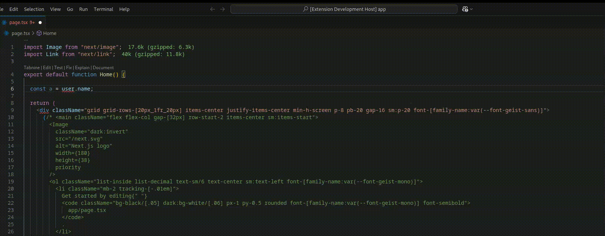

# Name My Variable

In software engineering, two notoriously difficult things are cache invalidation and naming things. While we can't help with the first one, we've got your back for the second! 😉

A Visual Studio Code extension that helps developers write more readable code by suggesting meaningful variable names. Perfect for JavaScript and TypeScript projects.

## Features

- 🤖 AI-powered variable name suggestions
- ✨ Instant inline suggestions without modifying your code
- 🎯 Context-aware naming based on value and usage
- 🔄 Multiple naming options for flexibility
- 💡 Supports JavaScript and TypeScript files

## Installation

1. Open Visual Studio Code
2. Go to Extensions (Ctrl+Shift+X)
3. Search for "Name My Variable"
4. Click Install

## How to Use

1. Write a variable assignment (e.g., `const abc = 123`)
2. Place your cursor on the line containing the variable assignment
3. Open the Command Palette (Ctrl+Shift+P)
4. Type and select "Generate variable names"
5. View suggested variable names as inline comments

## Requirements

- Visual Studio Code 1.98.0 or higher

## Known Issues

[Report issues on our GitHub repository](https://github.com/RChaubey16/name-my-variable/issues)

## Contributing

We welcome contributions! Please feel free to submit a Pull Request.

## License

This project is licensed under the MIT License - see the LICENSE file for details.

## Release Notes

### 1.0.0

- Initial release
- Basic variable name suggestions for JavaScript and TypeScript
- Inline suggestion display
